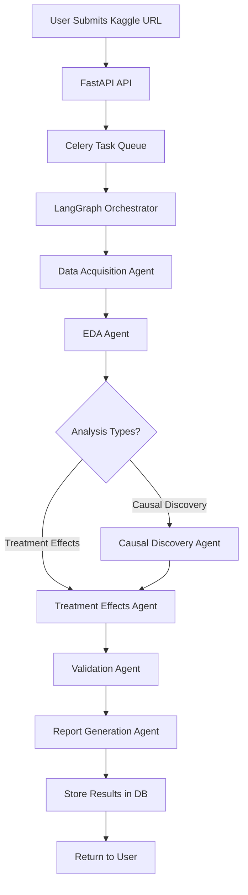
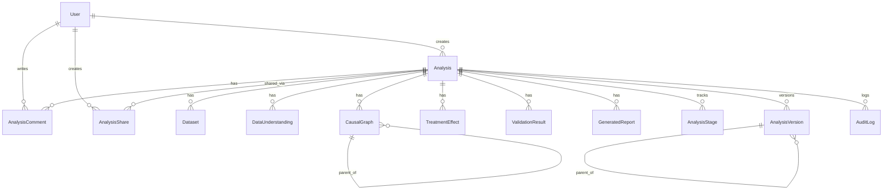
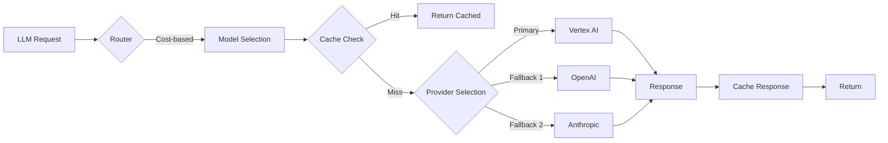
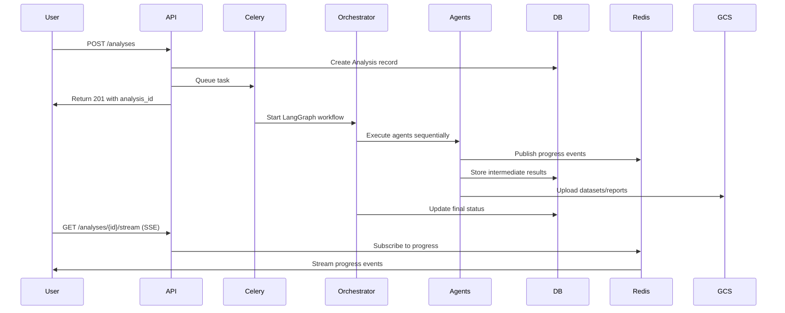
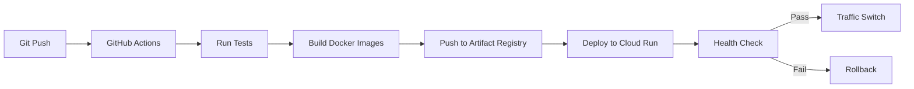
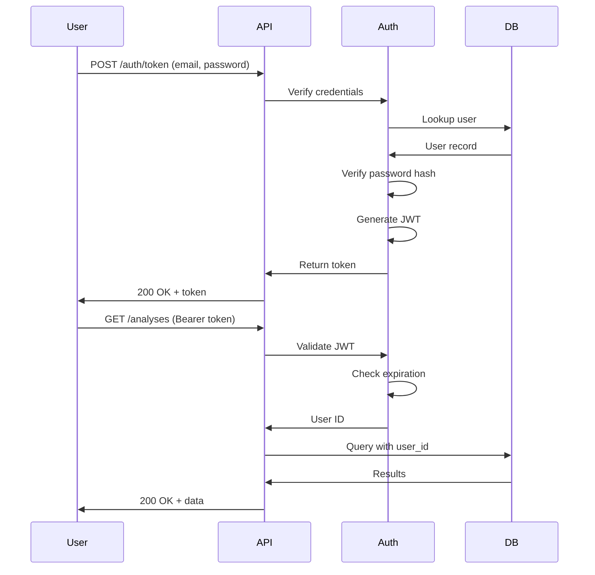

# System Architecture

This document describes the architecture of the Causal Analysis Agent system.

## System Overview

The Causal Analysis Agent is a multi-agent system for automated causal inference on tabular datasets. It uses a microservices architecture with the following key components:

- **FastAPI Backend**: RESTful API for client interactions
- **Celery Workers**: Asynchronous task processing
- **LangGraph Orchestrator**: Multi-agent workflow coordination
- **PostgreSQL**: Persistent data storage
- **Redis**: Caching, pub/sub messaging, and rate limiting
- **Google Cloud Storage**: File storage for datasets and reports

### Tech Stack

| Component | Technology | Version |
|-----------|------------|---------|
| Backend Framework | FastAPI | 0.109+ |
| Task Queue | Celery | 5.3+ |
| Agent Framework | LangGraph | 0.1+ |
| Database | PostgreSQL | 15+ |
| Cache/Pub-Sub | Redis | 7+ |
| Object Storage | Google Cloud Storage | - |
| LLM Providers | OpenAI, Anthropic, Vertex AI | - |
| Containerization | Docker | 24+ |
| Orchestration | Docker Compose / Cloud Run | - |

---

## Agent Flow

The analysis pipeline consists of six specialized agents coordinated by LangGraph:



### Agent Responsibilities

#### Data Acquisition Agent
- Downloads datasets from Kaggle (competitions and datasets)
- Implements retry logic with exponential backoff
- Caches downloaded files to avoid repeated downloads
- Samples large datasets (>1M rows) for performance
- Selects appropriate file from multi-file datasets

**Key Files:**
- `backend/app/agents/data_acquisition.py`

#### EDA Agent
- Computes summary statistics (mean, std, quartiles, etc.)
- Detects data types (numeric, categorical, datetime)
- Identifies quality issues (missing values, duplicates, outliers)
- Uses LLM to suggest preprocessing steps
- Recommends treatment/outcome variables based on data characteristics

**Key Files:**
- `backend/app/agents/eda.py`

#### Causal Discovery Agent
- Runs multiple discovery algorithms:
  - **PC Algorithm**: Constraint-based, assumes no latent confounders
  - **GES (Greedy Equivalence Search)**: Score-based optimization
  - **FCI (Fast Causal Inference)**: Handles latent confounders
- Generates DAG (Directed Acyclic Graph) representing causal structure
- Computes confidence scores for discovered edges

**Key Files:**
- `backend/app/agents/causal_discovery.py`

#### Treatment Effects Agent
- Estimates Average Treatment Effect (ATE) using multiple methods:
  - **PSM (Propensity Score Matching)**: Matches treated/control units
  - **Doubly Robust**: Combines outcome modeling and propensity scores
  - **IV (Instrumental Variables)**: Handles endogeneity
- Computes confidence intervals
- Calculates consensus estimate across methods

**Key Files:**
- `backend/app/agents/treatment_effects.py`

#### Validation Agent
- Runs refutation tests:
  - **Placebo Treatment**: Replaces treatment with random variable
  - **Random Common Cause**: Adds random confounders
  - **Data Subset**: Tests on random subsets
- Computes overall confidence score
- Identifies potential issues with causal claims

**Key Files:**
- `backend/app/agents/validation.py`

#### Report Generation Agent
- Generates four report types:
  - **Executive Summary**: Non-technical overview
  - **Technical Report**: Detailed methodology and statistics
  - **Visualization Report**: Graphs and charts data
  - **Validation Report**: Refutation test results
- Exports to multiple formats: PDF, Markdown, HTML, PPTX, JSON

**Key Files:**
- `backend/app/agents/report_generation.py`

---

## Database Schema



### Key Tables

| Table | Purpose |
|-------|---------|
| `users` | User accounts and authentication |
| `analyses` | Analysis metadata and configuration |
| `datasets` | Downloaded dataset metadata |
| `data_understandings` | EDA results and statistics |
| `causal_graphs` | Discovered causal structures |
| `treatment_effects` | Effect estimates with CIs |
| `validation_results` | Refutation test outcomes |
| `generated_reports` | Report content and file paths |
| `analysis_stages` | Progress tracking per stage |
| `analysis_versions` | Configuration version history |
| `analysis_shares` | Share links and access control |
| `analysis_comments` | Collaboration comments |
| `audit_logs` | Action audit trail |
| `llm_logs` | LLM API call records |

---

## State Management

### Analysis State

The orchestrator maintains analysis state in `AnalysisState` (defined in `backend/app/orchestrator/state.py`):

```python
@dataclass
class AnalysisState:
    analysis_id: str
    kaggle_url: str
    config: dict
    current_stage: str
    progress_percent: int

    # Data from agents
    dataset_path: Optional[Path]
    eda_results: Optional[dict]
    causal_graph: Optional[dict]
    treatment_effects: Optional[list]
    validation_results: Optional[dict]
    reports: Optional[dict]

    # Error handling
    error: Optional[str]
    warnings: list[str]
```

### Checkpointing

LangGraph provides automatic checkpointing for resumable workflows:

1. State is serialized after each agent completes
2. Stored in PostgreSQL via SQLAlchemy
3. On worker restart, workflow resumes from last checkpoint
4. Prevents lost work due to transient failures

### Progress Tracking

Real-time progress is communicated via:

1. **Redis Pub/Sub** (primary): Fast, real-time updates
2. **Database Polling** (fallback): If Redis unavailable

Progress events include:
- `analysis_id`: UUID of the analysis
- `stage`: Current agent (eda, discovery, etc.)
- `status`: running, completed, failed
- `progress_percent`: 0-100
- `message`: Human-readable status

---

## LLM Router Architecture



### Cost-Based Routing

The router selects models based on task complexity:

| Task Type | Model | Rationale |
|-----------|-------|-----------|
| Simple extraction | GPT-3.5-turbo | Low cost, fast |
| Statistical analysis | GPT-4 | Better reasoning |
| Complex interpretation | Claude-3-opus | Best for nuanced analysis |

### Provider Fallback

If the primary provider fails:
1. Vertex AI (primary) -> OpenAI (fallback 1) -> Anthropic (fallback 2)
2. Automatic retry with exponential backoff
3. Circuit breaker prevents cascading failures

### Caching

Redis caches LLM responses:
- Cache key: Hash of (prompt, model, temperature)
- TTL: 24 hours by default
- Hit rate target: >30% for cost savings

---

## Data Flow



### Request Flow

1. **API Request**: User submits Kaggle URL
2. **Validation**: URL format and rate limits checked
3. **Record Creation**: Analysis record created in PostgreSQL
4. **Task Queuing**: Celery task enqueued
5. **Response**: 201 with analysis ID returned immediately

### Processing Flow

1. **Worker Pickup**: Celery worker claims task
2. **Orchestration**: LangGraph coordinates agents
3. **Progress Updates**: Published to Redis channel
4. **Data Storage**: Results stored in PostgreSQL
5. **File Upload**: Reports uploaded to GCS

### Result Retrieval

1. **Polling**: Client polls for status
2. **Streaming**: SSE connection for real-time updates
3. **Results**: Fetched from database
4. **Downloads**: Signed URLs for GCS files

---

## Deployment Architecture

### Local Development (Docker Compose)

```
┌─────────────────────────────────────────────────────────┐
│                    Docker Compose                        │
├─────────────┬─────────────┬─────────────┬───────────────┤
│   backend   │   frontend  │   postgres  │     redis     │
│  (FastAPI)  │   (Next.js) │    (DB)     │   (Cache)     │
├─────────────┼─────────────┴─────────────┴───────────────┤
│   celery    │                                           │
│  (Worker)   │                                           │
└─────────────┴───────────────────────────────────────────┘
```

Services:
- `backend`: FastAPI application (port 8000)
- `frontend`: Next.js application (port 3000)
- `postgres`: PostgreSQL database (port 5432)
- `redis`: Redis server (port 6379)
- `celery-worker`: Celery worker process

### Production (Google Cloud Platform)

```
┌─────────────────────────────────────────────────────────┐
│                  Google Cloud Platform                   │
├─────────────────────────────────────────────────────────┤
│   ┌─────────────┐    ┌─────────────┐    ┌───────────┐  │
│   │  Cloud Run  │    │  Cloud Run  │    │   Cloud   │  │
│   │  (Backend)  │    │  (Workers)  │    │   SQL     │  │
│   └──────┬──────┘    └──────┬──────┘    │ (Postgres)│  │
│          │                  │           └─────┬─────┘  │
│          │                  │                 │        │
│   ┌──────┴──────────────────┴─────────────────┴─────┐  │
│   │              Memorystore (Redis)                │  │
│   └─────────────────────────────────────────────────┘  │
│                                                         │
│   ┌─────────────────────────────────────────────────┐  │
│   │            Cloud Storage (GCS)                   │  │
│   │         (Datasets, Reports, Cache)               │  │
│   └─────────────────────────────────────────────────┘  │
└─────────────────────────────────────────────────────────┘
```

Services:
- **Cloud Run (Backend)**: Auto-scaling FastAPI instances
- **Cloud Run (Workers)**: Auto-scaling Celery workers
- **Cloud SQL**: Managed PostgreSQL
- **Memorystore**: Managed Redis
- **Cloud Storage**: Object storage for files

### CI/CD Pipeline



---

## Security Architecture

### Authentication Flow



### Security Features

| Feature | Implementation |
|---------|---------------|
| Password Hashing | bcrypt |
| Token Authentication | JWT (HS256) |
| CSRF Protection | Redis-stored tokens |
| Rate Limiting | SlowAPI + Redis |
| SQL Injection | SQLAlchemy ORM |
| XSS Prevention | HTML sanitization (bleach) |
| Security Headers | CSP, X-Frame-Options, HSTS |
| Secrets Encryption | Fernet for Kaggle credentials |

### CSRF Protection

1. Client requests CSRF token: `GET /api/v1/csrf-token`
2. Token stored in Redis with session ID
3. Client includes token in `X-CSRF-Token` header
4. Server validates token for state-changing requests

---

## Observability Stack

### Logging

- **Library**: structlog
- **Format**: JSON structured logs
- **Fields**: timestamp, level, message, request_id, user_id, analysis_id

Example log:
```json
{
  "timestamp": "2026-01-20T12:00:00Z",
  "level": "info",
  "message": "Analysis created",
  "request_id": "abc123",
  "user_id": "550e8400...",
  "analysis_id": "661f9511...",
  "kaggle_url": "https://..."
}
```

### Error Tracking

- **Service**: Sentry
- **Integration**: FastAPI middleware
- **Features**:
  - Automatic exception capture
  - Performance monitoring
  - Release tracking
  - User context

### Agent Tracing

- **Service**: LangSmith
- **Features**:
  - Full trace of agent execution
  - Token usage per call
  - Latency breakdown
  - Prompt/response pairs

### Metrics

- **LLM Costs**: Tracked per analysis and model
- **Cache Hit Rate**: Redis cache effectiveness
- **Latency**: Per-provider average latency
- **Error Rate**: Failure rate by stage

Access via admin endpoints:
- `GET /api/v1/admin/stats`
- `GET /api/v1/admin/llm-cache/stats`
- `GET /api/v1/admin/llm-logs`

---

## Scaling Considerations

### Horizontal Scaling

| Component | Scaling Strategy |
|-----------|-----------------|
| API | Add Cloud Run instances |
| Workers | Add worker pods/instances |
| Database | Read replicas, connection pooling |
| Redis | Cluster mode |
| Storage | GCS auto-scales |

### Performance Optimizations

1. **Dataset Sampling**: Large datasets (>1M rows) sampled
2. **LLM Caching**: Repeated prompts served from cache
3. **Async Processing**: Non-blocking I/O throughout
4. **Connection Pooling**: SQLAlchemy pool configuration
5. **Lazy Loading**: Related entities loaded on demand

### Resource Limits

| Resource | Default Limit |
|----------|--------------|
| Max concurrent analyses | 3 per user |
| Max analyses per hour | 10 per user |
| Max analyses per day | 50 per user |
| Max share links | 10 per analysis |
| Max comment length | 5000 characters |
| SSE timeout | 30 minutes |
